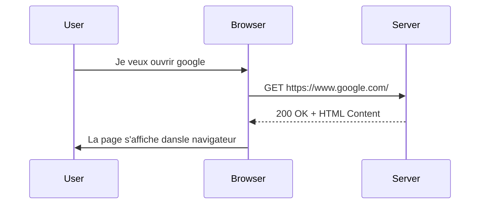

Bonjour à tous ! 👋 

Je voulais vous présenter rapidement le fameux protocole HTTP qui est la base du web !

**HTTP** (HyperText Transfer Protocol) est un **protocole de communication** 
entre un **client** (votre navigateur par exemple) et un **serveur**. 
Il permet d'échanger des **requêtes** et des **réponses** et ainsi d'afficher des pages web. 💻

Voici un résumé en 4 points de ce protocole hyper important sur Internet ! 😎

- Le client envoie une *requête HTTP* au serveur
- Le serveur renvoie une *réponse HTTP* 
- Il existe différents *verbes HTTP* comme GET, POST, etc.
- Les *codes de statut HTTP* indiquent si la requête a réussi (200 OK) ou échoué (404 Not Found)

J'espère que ce petit aperçu vous aura plu ! N'hésitez pas si vous avez des questions ! 😊

