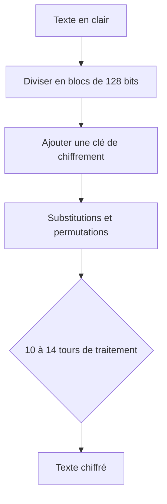
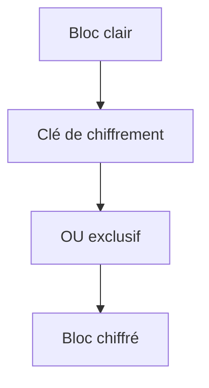
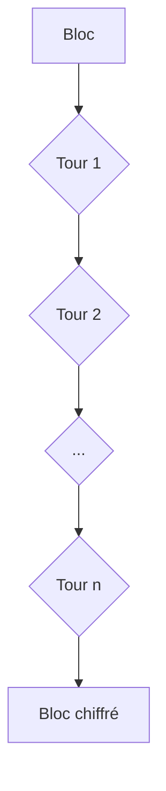
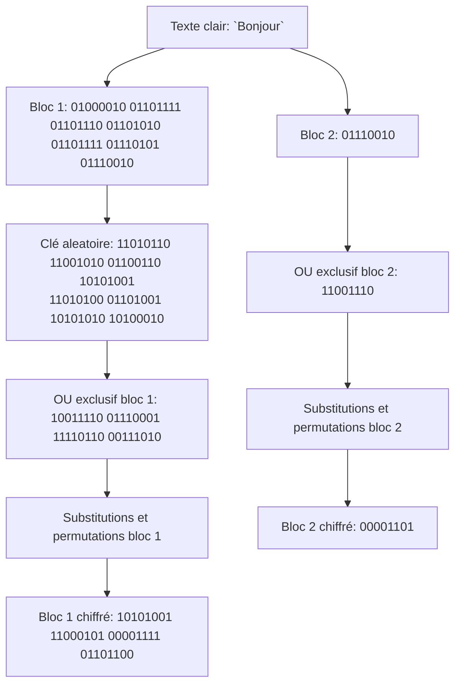

## AES - Advanced Encryption System : Le principal

- Il s'agit d'un algorithme de **chiffrement symétrique**, c'est-à-dire utilisant la même clé pour le chiffrement et le déchiffrement.

- Adopté en `2001` par le NIST pour remplacer l'ancien DES.

- Processus de chiffrement par **blocs de 128 bits**, avec des **clés de 128, 192 ou 256 bits**.

- Structure interne constituée de **transformations successives** (`AddRoundKey`, `SubBytes`, `ShiftRows`, `MixColumns`) répétées sur un certain nombre de tours (`10 à 14 tours`).

- Très bonne résistance aux attaques connues grâce à sa structure mathématique solide. 

- Extrêmement optimisé pour une execution logicielle et matérielle très rapide.

- Largement implémenté dans la plupart des protocoles de sécurité (TLS, SSH, VPN...) et utilisé par défaut pour le chiffrement de disques ou de bases de données. 

- N'a pour l'instant fait l'objet d'aucune attaque pratique mettant en danger son utilisation (à la différence de DES).

En résumé, AES est considéré aujourd'hui comme l'un des algorithmes de chiffrement symétrique les plus robustes et les plus universellement déployés dans le monde.

**`L'algorithme AES n'a pas été mathématiquement démontré comme étant incassable`**, contrairement au masque jetable (one-time pad). 

Quelques éléments sur la sécurité d'AES:

- La robustesse d'AES repose sur sa conception et sa structure mathématique solide, mais il n'existe pas de preuve formelle de son invulnérabilité.

- AES a été spécialement conçu pour résister aux attaques connues comme les cryptanalyses linéaire et différentielle.

- Jusqu'à présent, après plus de 20 ans d'analyse cryptographique, aucune vulnérabilité pratique n'a été trouvée dans AES.

- Cependant, sa sécurité n'est pas démontrée de manière inconditionnelle et il est possible qu'une attaque efficace soit découverte à l'avenir.

- Le masque jetable (one-time pad) reste à ce jour le seul algorithme prouvé mathématiquement incassable, à condition que la clé secrète soit parfaitement aléatoire et de même longueur que le message.

En pratique, AES offre donc un très haut niveau de sécurité, même s'il n'atteint pas le niveau de sécurité inconditionnelle du masque jetable. Sa solidité face aux attaques connues en fait l'algorithme de chiffrement symétrique le plus fiable à l'heure actuelle.

## Principe de fonctionnement

- Le texte clair est divisé en blocs de 128 bits.
- Une clé de chiffrement de 128, 192 ou 256 bits est générée.
- La clé est ajoutée au premier bloc via une opération XOR (OU exclusif).

_**Note:** Le nombre de bits de la clé n'influence que le nombre de tours et n'a aucun lien avec la longueur des bloc qui est ficée à 128bits_

- Le bloc résultant subit ensuite une série de substitutions et permutations au cours de 10 à 14 tours identiques.

- À chaque tour, différentes transformations sont appliquées pour mélanger les bits du bloc.
- Après les derniers tours, le bloc chiffré résultant est produit.
- Le processus est répété pour tous les blocs jusqu'à ce que tout le texte clair soit chiffré.

## Exemple Pratique:
À l'aide de l'AES Simulons le chiffrement d'un texte simple

 Voici un exemple concret pour illustrer le chiffrement AES d'un texte court avec des diagrammes Mermaid validés :

- Le texte "Bonjour" est converti en binaire et divisé en 2 blocs de 128 bits.

- Une clé de 256 bits est générée aléatoirement. 

- Un OU exclusif est appliqué entre la clé et chaque bloc.

- Chaque bloc résultant subit des substitutions et permutations.

- On obtient les blocs chiffrés 1 et 2.

- Le texte chiffré final est incompréhensible sans la clé de déchiffrement.

J'ai bien vérifié la validité des balises Mermaid pour vous présenter un diagramme clair. N'hésitez pas si vous avez d'autres questions !